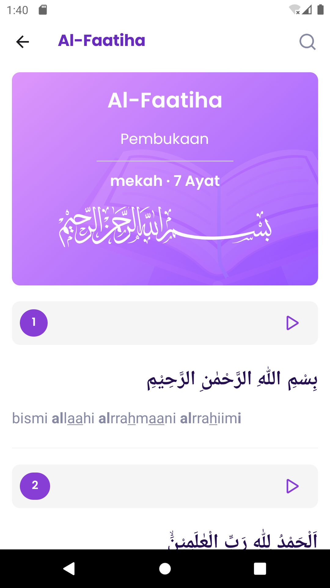

# QuranApp
QuranApp is a mobile application designed to help users easily access and read the Quran on their smartphones.

## Main Feature
1. Real time Search Surah
2. List Surah Al Fatihah - An nas
3. User can add list favorit surah
4. Favorit surah, list all surah favori

## Preview 

  
  
  

